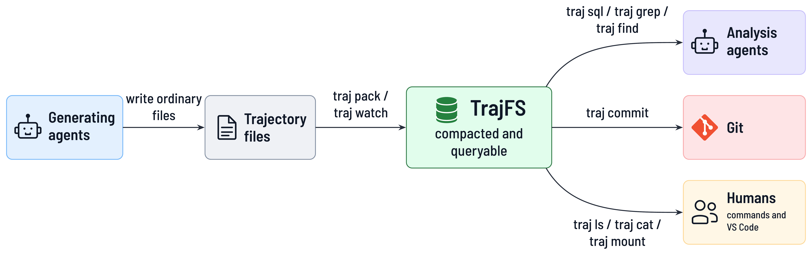

<p align="center">
  
</p>

# TrajFS: Make millions of AI-agent trajectory files gittable.

**Faster for Git. Friendly to agents. Still files for humans.**

AI-agent runs produce millions of tiny, duplicate-heavy files, making Git operations take hours. These trajectories
are not *gittable*! By *gittable*, we mean practical to manage with Git. TrajFS is a plugin that makes trajectories
gittable without changing the agents, while keeping the files viewable by both agents and humans.

Concretely, TrajFS bridges agent-generated files and Git-style management. Generating agents still write files.
Analysis agents get compacted, queryable trajectories that Git can manage. Humans examine the files through commands
and editors such as VS Code. The result: faster for Git, friendly to AI agents, and still files for humans.



Generating agents still write files. Analysis agents get compacted, queryable trajectories. Humans still inspect files with familiar tools.

---

[Quick start](#quick-start) | [Benchmarks](#benchmarks) | [Installation](#installation) | [How it works](#how-it-works)

## Quick start

[Install `traj`](#installation) first. These examples archive one task execution, `task-a`. A **round** is one
iteration of agent work and review; `reviewer/review.json` is the reviewing agent's output.

Replace the example paths with yours; TrajFS does not require this layout. A store contains the source tree you pass
to `pack`. Prefer keeping all agents and rounds of one task execution together.
[More on store granularity.](tasks/granularity.md)

### Pack, find, and read a task

```bash
traj pack /data/tasks/task-a --out stores/task-a.trajstore \
  --adapter copilot-cli --rules none

export TRAJ_STORE="$PWD/stores/task-a.trajstore"

traj ls -l
traj tree --depth 2
traj find --name 'review.json'
traj cat rounds/round-0001/reviewer/review.json
traj grep -l -e Traceback --name '*.std*'
traj du --depth 1
traj verify --deep
```

`TRAJ_STORE` selects the store for reading commands; `-S <store-path>` overrides it. Packing leaves the source tree
in place. Run `pack` again with the same source and destination to append new or changed entries without rewriting
old packs. If `pack` reports errors, do not treat the resulting store as a complete archive.

No Git setup is required for these commands. `traj grep` searches each distinct stored content once and reports
matches at all matching paths, rather than rereading every duplicate file.

**Choose retention deliberately.** `--rules none` disables exclusions. The default `no-build-products` profile
excludes common build products and caches; custom TOML rules are also supported. Exclusion records and reasons are
available in the `excluded` SQL view. Packing does not redact secrets or private content: review what you share.

The adapter affects interpretation, not whether ordinary files can be archived:

| Adapter | Use it for |
|---|---|
| `none` | Any run tree; paths and original file contents without event parsing |
| `copilot-cli` | Copilot CLI trajectories matching `**/events.jsonl` |
| `codex-cli` | Native `codex exec --json` streams matching `**/events.jsonl` |
| `auto` | Select Copilot, Codex, Claude Code or generic JSONL once per matching `**/events.jsonl` stream |
| `claude-code` | Claude Code session files matching `**/*.jsonl` |
| `jsonl` | Generic JSONL events; custom globs such as `--adapter 'jsonl:logs/*.jsonl'` |
| `path/to/adapter.toml` | A runner's own layout, path attributes, parsing rules, and completion markers |

Partial or malformed event lines are retained as `_unparsed` records; the stored trajectory bytes remain the
authoritative original. See `traj <command> --help` for each command's options.

### Open the archive like a directory

On Linux with FUSE (Filesystem in Userspace), mount the selected store without extracting it:

```bash
traj mount "$HOME/traj-mnt/task-a" --daemon
ls "$HOME/traj-mnt/task-a"
code -r "$HOME/traj-mnt/task-a"          # Optional: open in VS Code
traj umount "$HOME/traj-mnt/task-a"
```

The mountpoint must be empty and, by default, outside every Git worktree. Files are **read-only**; newly packed
batches become visible without remounting. Use `--memory 2G` to set a best-effort memory target instead of the default
20% of system RAM.

Mounting also updates available VS Code host settings to exclude the tree from file watching and mark it read-only.
Use `--no-vscode` to leave those settings untouched. For whole-store searches, prefer `traj grep` or `traj sql`:
ordinary recursive tools still traverse every mounted path.

For writable files, extract into a new destination outside Git:

```bash
traj extract rounds/round-0001 /tmp/traj-round-0001
```

`traj edit <path>` opens a temporary copy in `$EDITOR` and prints a diff; it never writes back into the store.
You do not need FUSE for any of these native CLI commands.

### Delete one trajectory

Deletion is rare and deliberate. It removes one catalog path, a file or a whole subtree such as a round, from every
batch, and keeps the earlier version in Git:

```bash
traj delete rounds/round-0002            # dry run: what would be removed
traj delete rounds/round-0002 --yes      # rebuild, verify, swap in
traj commit "$TRAJ_STORE"                # checkpoint the deletion
```

The store must be committed and unchanged before `--yes`, and no `traj mount` may serve it (the command names the
mountpoints to unmount). Later packs of the same source skip the deleted path. If an apply is interrupted,
`traj delete --recover` discards the leftover sibling directory; the store itself is always either the old or the
new verified version. [Protocol.](tasks/PLAN-deletion.md)

### Query events and compare tasks

With the `copilot-cli` adapter from the quick start:

```bash
traj sql "
  SELECT tool_name, count(*) AS calls
  FROM events
  WHERE type = 'tool.execution_complete'
  GROUP BY tool_name
  ORDER BY calls DESC"
```

After packing another task, repeat `-S` to query both stores. Here, `sha` is a content hash: identical contents share
the same value.

```bash
traj -S stores/task-a.trajstore -S stores/task-b.trajstore sql "
  SELECT store, count(*) AS recorded_paths, count(DISTINCT sha) AS distinct_contents
  FROM files
  GROUP BY store
  ORDER BY store"
```

SQL exposes `files`, `dirs`, `excluded`, `blobs` (the pack index), and `events` when derived.
`text(sha)` and `blob(sha)` read stored content from queries; `--csv` produces CSV output.

Catalog SQL views include published batch history, not just the latest version of each path. File-like commands and
mounts resolve the latest compatible file/directory namespace. Incremental event tables parse complete changed
trajectories, so growing logs can repeat earlier events across batches. `traj derive --adapter <name-or-TOML>`
rebuilds events from the latest retained trajectories; `pack --no-derive` and `watch --no-derive` let you defer parsing.

### Automate archival and commit stores, not raw trees

For a Git-backed experiment repository, keep two separate roots. This example uses a different source root and store
from the quick start:

```text
/data/experiments/          Raw task directories, outside every Git worktree
<experiment-repo>/stores/   Packed stores, the form you commit
```

Automatic watching needs an adapter that defines **when a batch is ready**. Built-in format adapters only parse
events; they do not know your runner's completion markers. Choose the adapter before the first pack: appending with
a different adapter name is rejected, so use a new store when switching from `copilot-cli` to `my-runner`.

<details>
<summary>Example: save a rounds-style adapter as <code>trajfs/adapter.toml</code> in your experiment repository</summary>

```toml
name = "my-runner"
rules = "none"

[[attrs]]
pattern = '^rounds/round-(?P<round>\d+)/(?P<role>[^/]+)/'
strip_leading_zeros = ["round"]

[trajectories]
globs = ["**/events.jsonl"]
format = "copilot-cli"

[batch_ready]
run_glob = "task-*"
markers = ["rounds/round-*/DONE"]
label_ancestor_pattern = '^round-\d+$'

[hook]
raw_patterns = ['(^|/)rounds/round-\d+/']
```

For a tree containing both Copilot and native Codex calls, explicitly set
`format = "auto"` and increment the declared adapter version. Detection uses
native event headers and falls back to generic JSONL for unknown streams.
Malformed lines remain `_unparsed` events. Codex events retain the complete
native JSON record, item/thread identities, tool type and exit code; usage
keeps its native cumulative semantics. Only declare one canonical stream
per call: do not also match copied rollouts or normalized telemetry. Existing
packed bytes and derived tables remain unchanged until an explicit pack or
`traj derive --adapter ...` operation.

Named regex groups become `files.attrs` keys, such as `round` and `role`. Adjust the event format, directory layout,
and completion markers to your runner. Despite its name, `run_glob` here selects task directories such as `task-1`.
A `DONE` file triggers a capture of the task tree; it does not restrict that capture to one round or mean the whole
task has finished.

</details>

From that experiment repository, initialize the integration and commit its configuration once:

```bash
traj init --data-root /data/experiments --store-root stores \
  --adapter trajfs/adapter.toml --rules none
traj doctor

git add trajfs.toml trajfs/adapter.toml stores/.gitattributes stores/.gitkeep \
  .claude/skills/traj/SKILL.md AGENTS.md
git commit -m "Set up TrajFS"
```

`init` writes the configuration, store attributes, a Git pre-commit hook, and agent instructions. It respects Git's
hook location and refuses to replace an unrelated hook unless explicitly requested. Using `--scaffold-adapter`
instead of `--adapter` generates editable templates; review their retention rules before packing, including the
scaffolded rule template's 20 MiB file-size cutoff.

With a Git remote configured, archive manually or watch for completed rounds:

```bash
traj pack /data/experiments/task-1 --label round-0001 &&
  traj commit --push stores/task-1.trajstore

# Or keep packing and committing when new completion markers appear:
traj watch --commit --push
```

`traj commit` commits only the selected store, preserving unrelated staged and unstaged work. The hook checks staged
Git content, rejecting configured raw-run paths, incomplete stores, and oversized artifacts. Defaults allow at most
10,000 added paths per commit and 65 MiB per file. `traj hook check-tree HEAD` checks a committed tree.

For nested source directories, default store paths encode the data-root-relative path so matching basenames do not
collide. In a configured repository, `traj mount <mountpoint>` without a store selection mounts all stores under
`store_root`; unset `TRAJ_STORE` first if you exported it above. Add `--save` to remember the mountpoint and write
repository-level VS Code settings.

## Benchmarks

These are **previously recorded measurements**, not reruns against the latest refactors. Results depend on retention
rules, duplication, hardware, and cache state; storage reduction is not a runtime speedup. The saved Rust report does
not include a complete hardware/software inventory or confidence intervals.

### Example task archives

These archives contain agent logs, status files, reviews, and workspace snapshots accumulated over many rounds.
**Task A-D are readable aliases for the recorded datasets**, not new measurements.
The [implementation report, section 14](docs/PLAN.md) records the results on **2026-09-04**; Task B was not measured.

| Example archive | Retained paths | Retained content | Packs + catalog | Pack | Deep verify |
|---|---:|---:|---:|---:|---:|
| Task A | 2,140,904 | 12.0 GB | ~481 MB | 118 s | 21 s |
| Task B | Not measured | -- | -- | -- | -- |
| Task C | 1,868,148 | 5.9 GB | ~451 MB | 75 s | 16 s |
| Task D | 699,040 | 4.7 GB | ~362 MB | 55 s | 13 s |

Retained paths are the archived file entries; retained content is their total size after filtering.
Packs + catalog is the archive footprint **before optional parsed event tables**, which add 359 MB, 251 MB, and
269 MB for Tasks A, C, and D respectively. Sizes use the report's rounded MB/GB units. Use `--no-derive` when you only
need the core archive.

The core stores are roughly **13-25x smaller than the retained content**. This comparison starts **after retention
filtering**; discarded build products are not counted as compression savings. Task A records **23,685 distinct
stored contents** and **at most 20 non-derived store files** instead of over two million logical paths.

For a smaller sample, one round of Task A contained **105,940 retained paths / 450 MB**, packed into about
**18.6 MB in 3.1 s**. This is a subset of Task A, not another whole-task result.

### Reading and querying the million-path store

The same report records these timings on Task A. **Warm-cache** means the operating system could reuse data already
in memory; **whole-process** includes starting the CLI, not just its internal lookup.

| Task | Recorded time |
|---|---:|
| List one directory | 70 ms |
| `stat` or `cat` one file | 40 ms |
| Find a completion-marker filename (`COMPLETE`), about 133,000 hits | 430 ms |
| SQL file counts/bytes grouped by round | 180 ms |
| SQL tool-call counts over 3.9 million event rows | 70 ms |
| SQL `text(sha)` on 76 review records | 800 ms |

Separate reference-round measurements after lookup tuning reported **10-20 ms listings** and **about 10 ms
whole-process point reads**; see section 15 of the same report.

The [Linux FUSE measurements](docs/PLAN-fuse.md) recorded **3 ms cold / 2 ms warm** to read a 6 KB file. But recursive
round listing took **1.8 s cold through the mount versus 0.31 s on native files**. The mount preserves file-tool
compatibility, not a promise that every recursive operation is faster.

<details>
<summary>Earlier million-file prototype and raw benchmark records</summary>

The [historical prototype result](review-bench/fullrun.json) records **2,173,703 regular files**, totaling
**12,928,153,598 retained bytes**, stored in **472,254,625 bytes across 13 files**: about **27.4x smaller**.
It used content-addressed Parquet containing the blob bytes, not the current Rust zstd-pack format.

Its retention rules and counted file types differ from the later Rust runs, so the two sets of results should not
be mixed. The [one-round raw measurements](review-bench/bench.json), [prototype scripts](review-bench/), and
[approach comparison](docs/idea-review.md) preserve the earlier tar/Parquet investigation and its limitations.

</details>

### Measure your own workload

Prepare a store with explicit retention and adapter settings, then record timings:

```bash
mkdir -p review-bench/history
traj -S stores/task-a.trajstore bench \
  --ls-dir rounds/round-0001 \
  --file rounds/round-0001/reviewer/review.json \
  --find-name review.json \
  --out review-bench/history/
```

`traj bench` writes timestamped JSON into an existing output directory. It is a convenience timing report, not a
controlled comparison or correctness gate: confirm the individual commands succeed, compare repeated runs with
the same rules and cache conditions, and use `traj verify --deep` separately.
Its `verify_s` measures ordinary verification. On incremental stores, JSON path/blob counts describe the last batch,
while `store_bytes` includes the whole store, including derived tables.

## Installation

The documented setup targets **Linux**. Install a current stable Rust toolchain with
[rustup](https://rustup.rs/) and a C/C++ build toolchain. DuckDB is bundled in the default build; there is no separate
database service to install.

On Debian or Ubuntu, system prerequisites are:

```bash
sudo apt-get update
sudo apt-get install -y build-essential pkg-config

# Optional, only for read-only filesystem mounts:
sudo apt-get install -y fuse3
```

Build and install from this repository:

```bash
git clone https://github.com/jingliu9/TrajFS.git
cd TrajFS
cargo install --locked --path crates/traj
traj --help
```

Cargo installs `traj` into `~/.cargo/bin` by default; ensure it is on `PATH`. The first build includes the bundled
DuckDB C++ library and can take several minutes.

Default features enable SQL and Linux FUSE mounting. For a smaller build with **neither SQL nor mounting**:

```bash
cargo install --locked --path crates/traj --no-default-features
```

Mounting requires access to `/dev/fuse` and a working `fusermount3` helper; containers and restricted hosts may not
provide them. Packing, browsing, querying, and extraction work without mounting. Native Windows builds are not
supported by the current Unix filesystem implementation.

## How it works

TrajFS stores file content separately from the paths that refer to it. A SHA-256 hash identifies a file's bytes;
identical contents share storage even when they appear under different paths or in different batches of a store.

| Layer | Technology and purpose |
|---|---|
| CLI and ingestion | Rust, Clap, and Rayon for commands and parallel hashing/compression |
| File content | SHA-256-addressed blobs in Zstandard-compressed packs |
| Catalog and events | Apache Arrow / Parquet for paths, metadata, exclusions, indexes, and parsed events |
| Queries | Embedded DuckDB over the published Parquet files |
| File access | Optional Linux FUSE through `fuser`; no full extraction required |
| Runner integration | TOML adapters and retention rules, Git hooks, and exported agent instructions |

A store is a portable directory:

```text
task-a.trajstore/
  MANIFEST.json                Published batches and artifact inventory
  catalog/*.parquet            Paths, directory summaries, exclusions
  packs/*.pack                 Compressed content
  packs/index-*.parquet        Hash-to-pack locations
  derived/<adapter>/*.parquet  Rebuildable event tables
```

Small-file reads decompress their containing frame, rather than an entire archive. New batches add catalog
segments and previously unseen content. Generated artifacts are bounded by the smaller of the configured hook
limit and 60 MiB; large tables and content are split into physical segments.

### Reliability and scope

- **Published snapshots, not half-written batches.** Readers use the manifest's declared artifacts. Interrupted,
  unpublished output is ignored and cleaned up by the next pack; event rebuilds publish replacement generations.
- **Integrity, not encryption.** `cat`, `grep`, `extract`, mounts, and SQL content functions verify hashes by default;
  `verify --deep` re-hashes stored blobs. Keep private run data private, even when its packed representation is small.
- **Live runs are per-file checkpoints.** Ingestion binds each file to a captured inode and byte prefix. It does not
  produce an atomic snapshot of an entire changing run; pause the runner when you need that guarantee.
- **Append-oriented history, explicit deletion.** Removed source paths and newly excluded files are not purged
  from existing archives. `traj delete <path>` is the one deleting verb: it rebuilds the store without one file or
  subtree, deep-verifies the result, and swaps it in atomically; it requires the store to be committed first and no
  mount to serve it. [Protocol and recovery.](tasks/PLAN-deletion.md)
- **Files, not full backup metadata.** Supported entries are regular files, empty files, and symlink targets under
  UTF-8 paths. Regular-file modes normalize to 0644/0755 according to executable bits. Empty directories, ownership,
  ACLs, original xattrs, and special files are not preserved; `extract --mtime` restores recorded file timestamps.

Mount memory is a best-effort target, not a hard process-memory cap. Very large file reads and trajectory parsing
can materialize whole blobs. Bounded artifact sizes do not remove a Git host's total repository-size limits.

New stores use format 3 (format 2 plus the `deleted` list); readers also support formats 1 and 2. See [the storage design](docs/PLAN.md) and
[the mount design](docs/PLAN-fuse.md) for the detailed contracts and limitations.

## Development

The workspace has three crates: [`trajfs-core`](crates/trajfs-core) for storage and ingestion,
[`trajfs-adapters`](crates/trajfs-adapters) for event parsers and declarative adapters, and
[`traj`](crates/traj) for the CLI, SQL, Git integration, and mounts.

```bash
cargo test --locked --release
cargo bench --locked -p traj
```

Coverage includes property-based round trips, corruption handling, consistent live-file prefixes, interrupted writes,
incremental history, staged Git policy, SQL content access, adapters, and read-only mounts. FUSE integration cases
skip when the host lacks FUSE; real-dataset cases are opt-in through the `slow` feature and environment variables
documented in [the test plan](docs/PLAN.md).

Further reading: [design and test plan](docs/PLAN.md), [storage approach comparison](docs/idea-review.md),
[store granularity](tasks/granularity.md), [FUSE design and measurements](docs/PLAN-fuse.md), and
[why a mount instead of an editor extension](docs/vscode-viewer.md).

Diagram files: [vector PDF](tasks/task1-r1.pdf), [LuaLaTeX source](tasks/task1-r1.tex),
[icon credits](tasks/task1-r1-icons-LICENSE.txt), and [font license](tasks/fonts/barlow-semi-condensed/OFL.txt).
