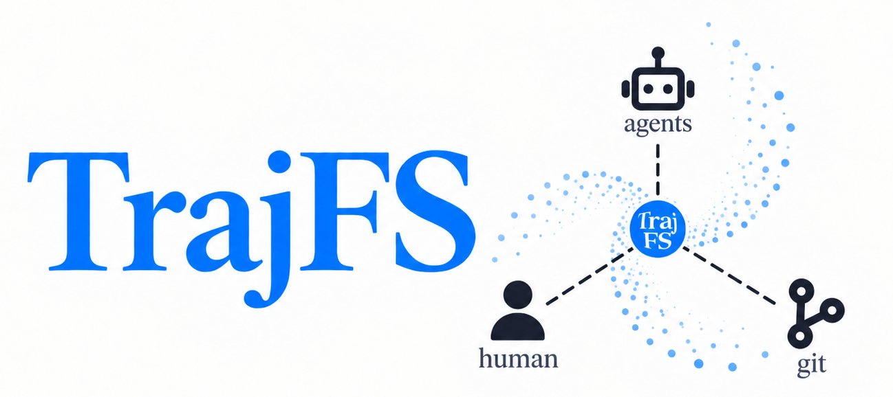
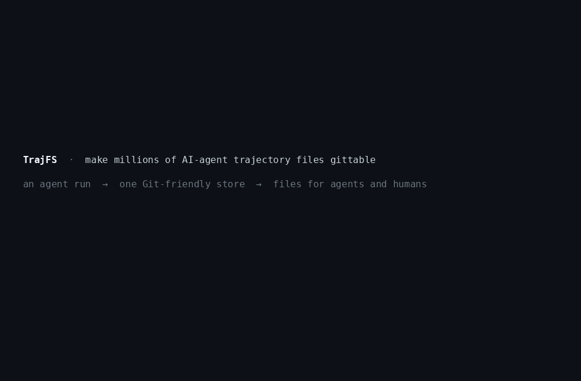
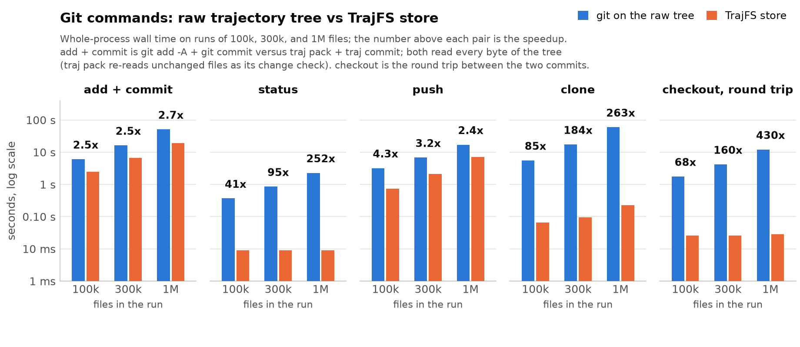
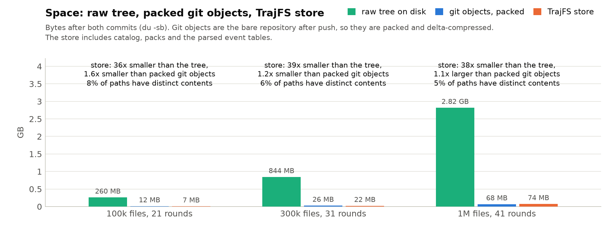
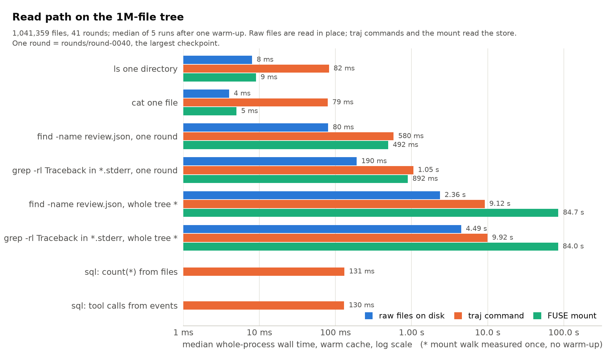

<p align="center">
  
</p>

# TrajFS: Make millions of AI-agent trajectory files gittable.

**Faster for Git. Friendly to agents. Still files for humans.**

AI-agent runs produce millions of tiny, duplicate-heavy files, making Git operations take hours. These trajectories
are not *gittable*! By *gittable*, we mean practical to manage with Git. TrajFS is a plugin that makes trajectories
gittable without changing the agents, while keeping the files viewable by both agents and humans.

Concretely, TrajFS bridges agent-generated files and Git-style management. Generating agents still write files.
Analysis agents get compacted, queryable trajectories that Git can manage. Humans examine the files through commands
and editors such as VS Code. The result: faster for Git, friendly to AI agents, and still files for humans.


Generating agents still write files. Analysis agents get compacted, queryable trajectories. Humans still inspect files with familiar tools.

---

[Quick start](#quick-start) | [How it works](#how-it-works) | [Benchmarks](#benchmarks) | [Installation](#installation) | [Guide](#guide)

## Quick start

<p align="center">
  
</p>

<p align="center"><sub>Recorded on a synthetic 1,000,000-file run (40 rounds of a coding agent, 5% distinct content, the rest byte-identical
checkpoints). Every number shown is measured; <code>demo/</code> regenerates it.</sub></p>

[Install `traj`](#installation), then archive one task in three steps. The example is a coding agent that worked in
**rounds**: each round is one iteration of agent work plus a review, and the runner wrote everything under
`/data/tasks/task-a`. TrajFS does not require this layout; use your own paths.

**1. Pack the raw tree into a store.** The source stays where it is.

```bash
traj pack /data/tasks/task-a --out stores/task-a.trajstore --adapter copilot-cli
```

`--adapter copilot-cli` parses the Copilot CLI `events.jsonl` streams into queryable event tables; use `claude-code`,
`codex-cli`, `auto`, or `none` for other runners ([adapters](#adapters-and-retention-rules)). Build products such as
`node_modules` and `__pycache__` are excluded by default. Run `pack` again later and it appends only what changed.

**2. Commit the store, not the raw files.**

```bash
traj commit --push stores/task-a.trajstore
```

A million-path run becomes a handful of files that Git handles in seconds ([benchmarks](#benchmarks)).

**3. Read it back.** No Git checkout, no extraction.

```bash
export TRAJ_STORE="$PWD/stores/task-a.trajstore"

traj ls -l rounds/round-0007/reviewer                    # list, like ls
traj cat rounds/round-0007/reviewer/review.json          # read one file
traj find --name review.json                             # every review, every round
traj grep -l -e Traceback --name '*.stderr'              # which logs failed
traj sql "SELECT tool_name, count(*) AS calls FROM events
          WHERE type = 'tool.execution_complete' GROUP BY 1 ORDER BY 2 DESC"
traj verify --deep                                       # every stored byte matches its hash
```

`traj grep` searches each distinct content once, so duplicate checkpoints cost nothing extra. `-S <store>` selects a
store without the environment variable and is repeatable for cross-store SQL.

**Agents use the same verbs.** `traj skill export --out .` writes a `SKILL.md` and an `AGENTS.md` section into your
repository, so Claude Code, Codex, or Copilot know to answer "which round first hit a Traceback?" with
`traj grep`, `traj sql`, and `traj cat` instead of walking a million files.

**Humans get files.** On Linux, mount the store read-only and open it in a terminal or VS Code:

```bash
traj mount ~/traj-mnt/task-a --daemon
ls ~/traj-mnt/task-a/rounds/round-0007/reviewer
code -r ~/traj-mnt/task-a
traj umount ~/traj-mnt/task-a
```

Newly packed batches show up without remounting. For writable copies, `traj extract <path> <destination>`.

Next: [automate archival with `traj watch` and a pre-commit hook](#automate-archival), [delete one trajectory](#delete-one-trajectory),
[query across tasks](#query-events-and-compare-tasks), and [what one store should contain](docs/granularity.md).

## How it works

TrajFS separates *what the bytes are* from *where they appear*. That single decision is what makes millions of
duplicate-heavy files cheap.

1. **Content-addressed packs.** Every file is hashed with SHA-256 and stored once, in Zstandard-compressed pack
   frames. A checkpoint that repeats yesterday's workspace adds paths, not bytes. Small-file reads decompress one
   frame, not an archive.
2. **A columnar catalog.** Paths, directory summaries, exclusions, and the hash-to-pack index are Apache Parquet
   segments. Listing a directory or finding a name is a column scan, not a filesystem walk, and the same segments
   are the tables behind `traj sql`.
3. **Published batches.** Each `pack` appends a batch and publishes it in `MANIFEST.json` at the end. Readers only
   ever see complete batches; an interrupted pack leaves nothing visible and is cleaned up by the next one.
4. **Derived event tables.** Adapters parse trajectory logs (Copilot CLI, Codex CLI, Claude Code, generic JSONL, or
   your own TOML-described layout) into Parquet event tables that can be rebuilt at any time with `traj derive`.
   Embedded DuckDB queries them; `text(sha)` and `blob(sha)` reach the stored content from SQL.
5. **A read-only file projection.** `traj mount` serves the catalog through FUSE with a bounded memory budget, so
   editors, diff tools, and shell scripts see ordinary files without extracting anything.
6. **Git sees only stores.** `traj commit` stages the store, a pre-commit hook refuses raw run trees and
   oversized artifacts, and every generated file stays under a size that Git hosts accept.

| Layer | Technology and purpose |
|---|---|
| CLI and ingestion | Rust, Clap, and Rayon for commands and parallel hashing/compression |
| File content | SHA-256-addressed blobs in Zstandard-compressed packs |
| Catalog and events | Apache Arrow / Parquet for paths, metadata, exclusions, indexes, and parsed events |
| Queries | Embedded DuckDB over the published Parquet files |
| File access | Optional Linux FUSE through `fuser`; no full extraction required |
| Runner integration | TOML adapters and retention rules, Git hooks, and exported agent instructions |

A store is a portable directory:

```text
task-a.trajstore/
  MANIFEST.json                Published batches and artifact inventory
  catalog/*.parquet            Paths, directory summaries, exclusions
  packs/*.pack                 Compressed content
  packs/index-*.parquet        Hash-to-pack locations
  derived/<adapter>/*.parquet  Rebuildable event tables
```

New batches add catalog segments and previously unseen content. Generated artifacts are bounded by the smaller of
the configured hook limit and 60 MiB; large tables and content are split into physical segments.

### Reliability and scope

- **Published snapshots, not half-written batches.** Readers use the manifest's declared artifacts. Interrupted,
  unpublished output is ignored and cleaned up by the next pack; event rebuilds publish replacement generations.
- **Integrity, not encryption.** `cat`, `grep`, `extract`, mounts, and SQL content functions verify hashes by default;
  `verify --deep` re-hashes stored blobs. Keep private run data private, even when its packed representation is small.
- **Live runs are per-file checkpoints.** Ingestion binds each file to a captured inode and byte prefix. It does not
  produce an atomic snapshot of an entire changing run; pause the runner when you need that guarantee.
- **Append-oriented history, explicit deletion.** Removed source paths and newly excluded files are not purged
  from existing archives. `traj delete <path>` is the one deleting verb: it rebuilds the store without one file or
  subtree, deep-verifies the result, and swaps it in atomically; it requires the store to be committed first and no
  mount to serve it. [Protocol and recovery.](docs/PLAN-deletion.md)
- **Files, not full backup metadata.** Supported entries are regular files, empty files, and symlink targets under
  UTF-8 paths. Regular-file modes normalize to 0644/0755 according to executable bits. Empty directories, ownership,
  ACLs, original xattrs, and special files are not preserved; `extract --mtime` restores recorded file timestamps.

Mount memory is a best-effort target, not a hard process-memory cap. Very large file reads and trajectory parsing
can materialize whole blobs. Bounded artifact sizes do not remove a Git host's total repository-size limits.

New stores use format 3 (format 2 plus the `deleted` list); readers also support formats 1 and 2.

Design documents with the detailed contracts and limitations: [storage and test plan](docs/PLAN.md),
[FUSE mount](docs/PLAN-fuse.md), [deletion protocol](docs/PLAN-deletion.md), [store granularity](docs/granularity.md),
and the superseded drafts under [docs/history/](docs/history/README.md).

## Benchmarks

All numbers below come from `bench/run.py` on **synthetic data anyone can regenerate**: a coding agent's task
directory checkpointed every round, so most paths are byte-identical copies of earlier rounds and only about
5% of the contents are distinct, the shape that motivated TrajFS. The recorded real runs are more
extreme (2.1 M paths, 1% distinct). Host: 40-core Intel Xeon Silver 4114, ext4, Linux 6.8.0, git 2.43.0. Whole-process wall time, warm cache.
[Details, tables, and reproduction commands.](docs/benchmarks/README.md)

**Git commands.** Committing a million raw files works, but every later operation pays for them again: `status`
walks the tree, `clone` and `checkout` materialize every file, `push` sends every object. The store is a handful of
files, so those become milliseconds.



| 999,580 files, 41 rounds | git on raw files | TrajFS | |
|---|---:|---:|---:|
| add + commit / pack + commit | 51 s | 19 s | **2.7x faster** |
| status | 2.3 s | 9 ms | **252x faster** |
| push to a local remote | 17 s | 7.0 s | **2.4x faster** |
| clone | 59 s | 0.2 s | **263x faster** |
| checkout one round back and forward | 12 s | 28 ms | **430x faster** |

**Space.** Git deduplicates identical blobs too, so the honest comparison is against Git's own object store, not
the raw tree.



| 999,580 files | Size |
|---|---:|
| raw tree | 2.82 GB |
| `.git` after two commits (loose objects) | 178 MB |
| Git objects packed (a bare clone) | 68 MB |
| TrajFS store, event tables included | 74 MB |

**Reading.** Point reads through the `traj` CLI cost a process start (tens of milliseconds); the FUSE mount
matches the raw filesystem for `ls` and `cat`. Whole-tree scans should use `traj grep`, `traj find`, or SQL, which
read the catalog and each distinct content once instead of walking a million inodes.



Synthetic data has limits: its text compresses better than real logs and its duplication is regular. Treat the
ratios as indicative and rerun on your own runs:

```bash
python3 bench/run.py --sizes 100000        # generate, measure git vs traj, write bench/results/*.json
traj -S stores/task-a.trajstore bench --out bench-results/   # repeated-run timings of one real store
```

`traj bench` repeats each verb (`--warmup`, `--runs`), reports min and median, and documents its JSON schema in
`--help`. It is a convenience timing report, not a correctness gate; use `traj verify --deep` for that.

<details>
<summary>Earlier measurements on real runs</summary>

The [implementation report](docs/PLAN.md) records, on 2026-09-04, packing a real 2.14 M-path, 12.0 GB run into
about 481 MB of packs and catalog (13-25x smaller than the retained content across three runs), with 70 ms
directory listings and 40 ms point reads on that store. Those runs are private, so they are not reproducible from
this repository; the synthetic benchmark above is.

</details>

## Installation

TrajFS runs on **Linux**. DuckDB is bundled; there is no service to install. Mounting needs FUSE
(`/dev/fuse` and `fusermount3`), everything else works without it.

### 1. Let an agent do it

Paste this into Claude Code, Codex, or Copilot CLI in the repository where you keep experiments:

```text
Install TrajFS from https://github.com/jingliu9/TrajFS: install the Rust toolchain if missing
(rustup), the build prerequisites (build-essential, pkg-config, fuse3 on Debian/Ubuntu), then
`cargo install --locked --git https://github.com/jingliu9/TrajFS traj`. Verify with `traj --help`.
Then run `traj skill export --out .` here so agents in this repo use traj to read trajectories, and show
me the three commands from its README quick start adapted to my run directory.
```

### 2. Manual

```bash
# Debian / Ubuntu prerequisites (fuse3 only for mounts)
sudo apt-get update && sudo apt-get install -y build-essential pkg-config fuse3
curl --proto '=https' --tlsv1.2 -sSf https://sh.rustup.rs | sh     # if you have no Rust toolchain

cargo install --locked --git https://github.com/jingliu9/TrajFS traj
traj --help
```

Or from a clone: `cargo install --locked --path crates/traj`. Cargo puts `traj` in `~/.cargo/bin`; the first build
compiles the bundled DuckDB and takes a few minutes. For a smaller binary with neither SQL nor mounting, add
`--no-default-features`. Native Windows is not supported.

## Guide

Everything past the three-step quick start.

### Adapters and retention rules

The adapter affects interpretation, not whether ordinary files can be archived:

| Adapter | Use it for |
|---|---|
| `none` | Any run tree; paths and original file contents without event parsing |
| `copilot-cli` | Copilot CLI trajectories matching `**/events.jsonl` |
| `codex-cli` | Native `codex exec --json` streams matching `**/events.jsonl` |
| `auto` | Select Copilot, Codex, Claude Code or generic JSONL once per matching `**/events.jsonl` stream |
| `claude-code` | Claude Code session files matching `**/*.jsonl` |
| `jsonl` | Generic JSONL events; custom globs such as `--adapter 'jsonl:logs/*.jsonl'` |
| `path/to/adapter.toml` | A runner's own layout, path attributes, parsing rules, and completion markers |

Partial or malformed event lines are retained as `_unparsed` records; the stored trajectory bytes remain the
authoritative original. See `traj <command> --help` for each command's options.

`--rules none` keeps everything; the default `no-build-products` profile drops common build products and caches, and
custom TOML rules are supported. Exclusions and their reasons are visible in the `excluded` SQL view. Packing does not
redact secrets or private content: review what you share.

### Open the archive like a directory

On Linux with FUSE (Filesystem in Userspace), mount the selected store without extracting it:

```bash
traj mount "$HOME/traj-mnt/task-a" --daemon
ls "$HOME/traj-mnt/task-a"
code -r "$HOME/traj-mnt/task-a"          # Optional: open in VS Code
traj umount "$HOME/traj-mnt/task-a"
```

The mountpoint must be empty and, by default, outside every Git worktree. Files are **read-only**; newly packed
batches become visible without remounting. Use `--memory 2G` to set a best-effort memory target instead of the default
20% of system RAM.

Mounting also updates available VS Code host settings to exclude the tree from file watching and mark it read-only.
Use `--no-vscode` to leave those settings untouched. For whole-store searches, prefer `traj grep` or `traj sql`:
ordinary recursive tools still traverse every mounted path.

For writable files, extract into a new destination outside Git:

```bash
traj extract rounds/round-0001 /tmp/traj-round-0001
```

`traj edit <path>` opens a temporary copy in `$EDITOR` and prints a diff; it never writes back into the store.
You do not need FUSE for any of these native CLI commands.

### Query events and compare tasks

With the `copilot-cli` adapter from the quick start:

```bash
traj sql "
  SELECT tool_name, count(*) AS calls
  FROM events
  WHERE type = 'tool.execution_complete'
  GROUP BY tool_name
  ORDER BY calls DESC"
```

After packing another task, repeat `-S` to query both stores. Here, `sha` is a content hash: identical contents share
the same value.

```bash
traj -S stores/task-a.trajstore -S stores/task-b.trajstore sql "
  SELECT store, count(*) AS recorded_paths, count(DISTINCT sha) AS distinct_contents
  FROM files
  GROUP BY store
  ORDER BY store"
```

SQL exposes `files`, `dirs`, `excluded`, `blobs` (the pack index), and `events` when derived.
`text(sha)` and `blob(sha)` read stored content from queries; `--csv` produces CSV output.

Catalog SQL views include published batch history, not just the latest version of each path. File-like commands and
mounts resolve the latest compatible file/directory namespace. Incremental event tables parse complete changed
trajectories, so growing logs can repeat earlier events across batches. `traj derive --adapter <name-or-TOML>`
rebuilds events from the latest retained trajectories; `pack --no-derive` and `watch --no-derive` let you defer parsing.

### Automate archival

For a Git-backed experiment repository, keep two separate roots. This example uses a different source root and store
from the quick start:

```text
/data/experiments/          Raw task directories, outside every Git worktree
<experiment-repo>/stores/   Packed stores, the form you commit
```

Automatic watching needs an adapter that defines **when a batch is ready**. Built-in format adapters only parse
events; they do not know your runner's completion markers. Choose the adapter before the first pack: appending with
a different adapter name is rejected, so use a new store when switching from `copilot-cli` to `my-runner`.

<details>
<summary>Example: save a rounds-style adapter as <code>trajfs/adapter.toml</code> in your experiment repository</summary>

```toml
name = "my-runner"
rules = "none"

[[attrs]]
pattern = '^rounds/round-(?P<round>\d+)/(?P<role>[^/]+)/'
strip_leading_zeros = ["round"]

[trajectories]
globs = ["**/events.jsonl"]
format = "copilot-cli"

[batch_ready]
run_glob = "task-*"
markers = ["rounds/round-*/DONE"]
label_ancestor_pattern = '^round-\d+$'

[hook]
raw_patterns = ['(^|/)rounds/round-\d+/']
```

For a tree containing both Copilot and native Codex calls, explicitly set
`format = "auto"` and increment the declared adapter version. Detection uses
native event headers and falls back to generic JSONL for unknown streams.
Malformed lines remain `_unparsed` events. Codex events retain the complete
native JSON record, item/thread identities, tool type and exit code; usage
keeps its native cumulative semantics. Only declare one canonical stream
per call: do not also match copied rollouts or normalized telemetry. Existing
packed bytes and derived tables remain unchanged until an explicit pack or
`traj derive --adapter ...` operation.

Named regex groups become `files.attrs` keys, such as `round` and `role`. Adjust the event format, directory layout,
and completion markers to your runner. Despite its name, `run_glob` here selects task directories such as `task-1`.
A `DONE` file triggers a capture of the task tree; it does not restrict that capture to one round or mean the whole
task has finished.

</details>

From that experiment repository, initialize the integration and commit its configuration once:

```bash
traj init --data-root /data/experiments --store-root stores \
  --adapter trajfs/adapter.toml --rules none
traj doctor

git add trajfs.toml trajfs/adapter.toml stores/.gitattributes stores/.gitkeep \
  .claude/skills/traj/SKILL.md AGENTS.md
git commit -m "Set up TrajFS"
```

`init` writes the configuration, store attributes, a Git pre-commit hook, and agent instructions. It respects Git's
hook location and refuses to replace an unrelated hook unless explicitly requested. Using `--scaffold-adapter`
instead of `--adapter` generates editable templates; review their retention rules before packing, including the
scaffolded rule template's 20 MiB file-size cutoff.

With a Git remote configured, archive manually or watch for completed rounds:

```bash
traj pack /data/experiments/task-1 --label round-0001 &&
  traj commit --push stores/task-1.trajstore

### Delete one trajectory

Deletion is rare and deliberate. It removes one catalog path, a file or a whole subtree such as a round, from every
batch, and keeps the earlier version in Git:

```bash
traj delete rounds/round-0002            # dry run: what would be removed
traj delete rounds/round-0002 --yes      # rebuild, verify, swap in
traj commit "$TRAJ_STORE"                # checkpoint the deletion
```

The store must be committed and unchanged before `--yes`, and no `traj mount` may serve it (the command names the
mountpoints to unmount). Later packs of the same source skip the deleted path. If an apply is interrupted,
`traj delete --recover` discards the leftover sibling directory; the store itself is always either the old or the
new verified version. [Protocol.](docs/PLAN-deletion.md)
