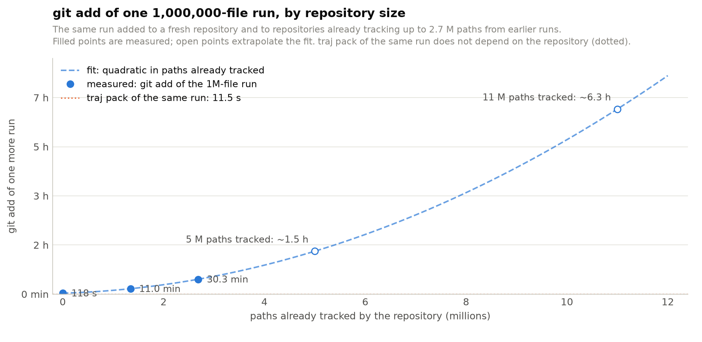

# When does Git take hours on trajectory trees?

The headline benchmark ([README](README.md)) commits one 1,000,000-file run into a fresh repository with a warm
page cache, and `git add` + `git commit` takes 51 s there. That is the best case. Two ordinary conditions turn the
same operation into minutes or hours, and both were measured on the same host with the same run.

## 1. The repository already holds runs

An experiment repository accumulates runs. Git keeps every tracked path in one sorted index file, and inserting N
new paths into an index that already has M entries shifts the array once per insertion, so `git add` of the next
run costs on the order of N times M. Measured with `bench/git_index_scale.py` (the same real run added to
repositories that already track 0, 1.3 M, and 2.7 M paths from earlier, sibling runs):

| paths already tracked | `git add` of the 1M-file run | `git commit` | `git status` afterwards | `.git/index` |
|---:|---:|---:|---:|---:|
| 0 | 118 s | 7.8 s | 2.2 s | 135 MB |
| 1,343,160 | 661 s (11 min) | 10.7 s | 4.5 s | 307 MB |
| 2,686,320 | 1,816 s (30 min) | 13.4 s | 7.5 s | 479 MB |



A quadratic fit through the three points (`118 + 176·M + 170·M²` seconds, M in millions of tracked paths)
extrapolates to about 1.5 h at 5 M tracked paths and about 6 h at 11 M. The original observation that motivated
TrajFS was adding a 2.17 M-path run to a repository whose index already held 11 M entries: it had not finished after
3.5 h. The extrapolation is indicative, not a measurement, but it is the right order of magnitude.

`traj pack` of the same run is 11.5 s whatever the repository holds, because the store adds a handful of files to
Git per batch, not a path per trajectory file.

## 2. The page cache is cold

Every `git add` (and every first `traj pack`) reads every byte of every file. With the data in the page cache
that costs seconds; from a spinning disk it costs a seek per file. Measured by evicting the run's data from the page
cache with `posix_fadvise(DONTNEED)` (5.3 GB released) and reading one round back serially:

| | 24,580 files, 63 MB | rate |
|---|---:|---:|
| warm (page cache) | 0.84 s | 29,000 files/s |
| cold (SATA HDD) | 117 s | 209 files/s |

At 209 files/s the million-file run takes about 80 min to read once, and the recorded real run (2.17 M files,
12.9 GB, on disk as 60.9 GB of 4 KB blocks) about 3 h. That is the cost of the first pass on a fresh machine, after
a reboot, or on network storage; it applies to any tool that must read the files, TrajFS included. What differs is
what happens afterwards: git keeps paying per path (status, clone, checkout, every later add), while the store is
read once and then queried.

## 3. What multiplies these

- **Bytes.** Git zlib-compresses every blob single-threaded at roughly 60 MB/s here (2.8 GB in 43 s); the recorded
  real run is 12.9 GB retained, so its hashing alone is around 4 min warm, and it was observed at 20 min on the
  original host.
- **Every clone and checkout.** A clone materializes every path again: 59 s here for 1 M files warm, and a
  cold-disk checkout writes a million inodes.
- **Push.** Packing 2 M loose objects for a push is CPU-bound delta compression; the recorded repository reached
  22 GB of objects before it was abandoned.

## Reproduce

```bash
python3 bench/synthetic_tree.py /data/scale/task-a --files 1000000 --rounds 40
python3 bench/git_index_scale.py --tree /data/scale/task-a --prior 0 2 4      # ~45 min; siblings are tiny files
venv/bin/python bench/plot_index_scale.py                                     # docs/benchmarks/git-index-scale.png
```

The cold-cache measurement needs no root: evict with `posix_fadvise(DONTNEED)` over every file, then time a serial
read of one round; see `bench/results/index-scale-*.json` for the recorded numbers and method.
