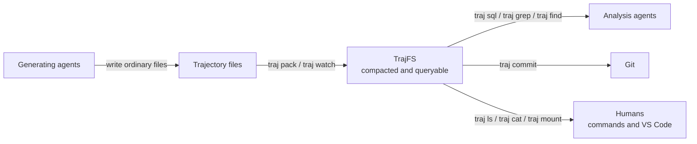

TrajFS: Make millions of AI agent trajectory files gittable.
[sloagan]

AI agent runs produce millions of tiny, duplicate-heavy files, making Git operations take hours -- these trajectoires are not gittable!
TrajFS is a plugin that manage the trajectories without the needs to modifying the AI agents and making the usage of git plausiable -- it makes the trajectories gittable, and remains viewable by both agents and humans.
[explain the key pain, and what does it mean by gittable. then using one sentence to describe the key characteris]

+ (next para) Concretely, TrajFS bridges the gap of git-style managing ment of agent trajectoriy files, and is friendly to multi-agents to generate (just files), and friendly for ai-agents to query the trajectories and git to manage(compacted and queryable), and for human to examine the files via commands and editors such as vscode (still files). We make the trajectories files faster for git, friendly to ai-agents, and viewable as files for human.
[generate a diagram to describe these, generation, analysis agent, and human vieable and the interface]

[don't modify above, append below]
===

# TrajFS: Make millions of AI-agent trajectory files gittable.

**Faster for Git. Friendly to agents. Still files for humans.**

AI-agent runs produce millions of tiny, duplicate-heavy files, making Git operations take hours. These trajectories
are not *gittable*! By *gittable*, we mean practical to manage with Git. TrajFS is a plugin that makes trajectories
gittable without changing the agents, while keeping the files viewable by both agents and humans.

Concretely, TrajFS bridges agent-generated files and Git-style management. Generating agents still write files.
Analysis agents get compacted, queryable trajectories that Git can manage. Humans examine the files through commands
and editors such as VS Code. The result: faster for Git, friendly to AI agents, and still files for humans.

===
R1: now, generate a latex style diagram (generate pdf) for this above mermaid charts, it's like use latex to draw the diagram, and then crop the pdf to be icnluded in this, put the results in this tasks directory
===

[Cropped PDF](task1-r1.pdf) | [LaTeX source](task1-r1.tex)

==
R2, look at ../trajfs-ref1.png, read the contents, and
modify the design of task1-r1 to be the same as these
key points
1. use the icons and colors the same as those
2. use that style of flow-chart (not so strighted and broken squere style of arrow for the right-side 3 arrows)
3. use the icon (you can definitely search some good ones online)
4. high-resolution!
[DON't MODIFY]
==

[Vector PDF](task1-r1.pdf) | [600-DPI PNG](task1-r1.png) |
[LaTeX source](task1-r1.tex) | [Icon credits](task1-r1-icons-LICENSE.txt)

==
R3: good, then
1. change fonts to more icon-style font, looks elegant (now it is like document and the font int are genrally short and looks adhoc)
2. make the small label font size larger (1.5 times right now), if it does not fit, you can make it two lines for certain labels
==

Barlow Semi Condensed, with small labels enlarged by 1.5x and wrapped where needed.

[Vector PDF](task1-r1.pdf) | [600-DPI PNG](task1-r1.png) |
[LuaLaTeX source](task1-r1.tex) | [Font license](fonts/barlow-semi-condensed/OFL.txt)

Build from `tasks/`: `lualatex task1-r1.tex`.

==
R4:
now, make the plan to support deletion, the deltion granularity is one single trajectory, this is a rare command, and correctness is important.
write the plan to PLAN-deletion.md
===

[Deletion plan](PLAN-deletion.md): remove one trajectory, a file or a subtree such as a round or task, from every
batch while keeping Git history. Refined 2026-09-06 into the transaction protocol for `pack` and `delete`
(rebuild, deep-verify, atomic exchange, Git as the recovery anchor) and implemented as `traj delete`.

==
R5:
write the granularity of one store and how it affect things in tasks/granularity.md

[Store granularity](granularity.md): what a store contains today, why one task execution per store is the recommended
default, and the effects on deduplication, ingestion, queries, Git, concurrency, and deletion.

==
R6:
refine the README.md, replace the descriptions assuming onesw-gen context, makeing them easy to understand by lay audience of ai-agents, give right smallest context for example, the table containing opus--xxx, just say TaskA (something like this).

[README](../README.md) now uses Task A-D aliases and explains the example task layout, rounds, and benchmark units
without requiring knowledge of the original runner or model identifiers.

==
R7:
refine the README.md
use these:

# TrajFS: Make millions of AI-agent trajectory files gittable.

**Faster for Git. Friendly to agents. Still files for humans.**

AI-agent runs produce millions of tiny, duplicate-heavy files, making Git operations take hours. These trajectories
are not *gittable*! By *gittable*, we mean practical to manage with Git. TrajFS is a plugin that makes trajectories
gittable without changing the agents, while keeping the files viewable by both agents and humans.

Concretely, TrajFS bridges agent-generated files and Git-style management. Generating agents still write files.
Analysis agents get compacted, queryable trajectories that Git can manage. Humans examine the files through commands
and editors such as VS Code. The result: faster for Git, friendly to AI agents, and still files for humans.

<insert task1-r1.png>

Generating agents still write files. Analysis agents get compacted, queryable trajectories. Humans still inspect files with familiar tools.
---

[README](../README.md) uses this opening and the refined diagram, preserving the supplied wording and sequence.

==
R8:
refine the README.md
add the trajfs-log.png
refer to: https://github.com/StarTrail-org/LEANN
for the position to add

[README](../README.md) now places the supplied [logo](../docs/trajfs-logo.png) centered above the title, following
LEANN's placement.